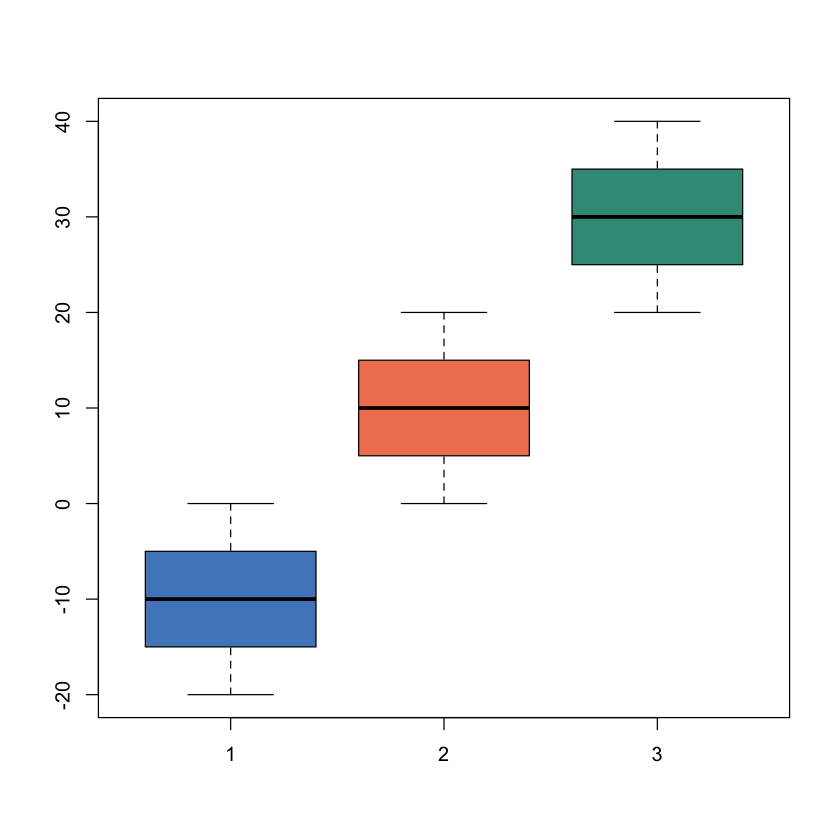
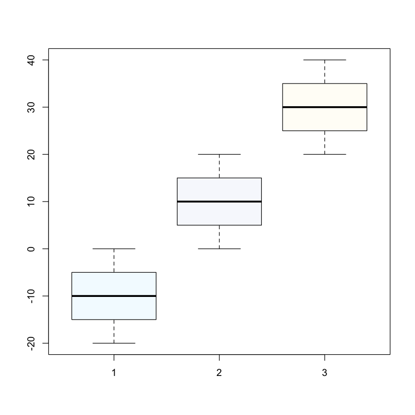
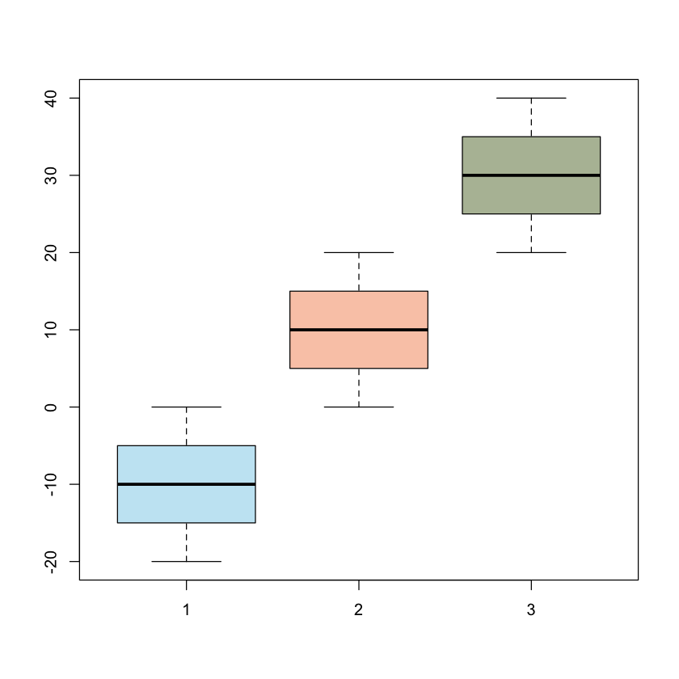

# Generating plots in R using Arcadia colors

R package to generate color palettes using Arcadia Science's colors.

# How to install

The ArcadiaColorBrewer R package can be installed using devtools:

```R
devtools::install_github("Arcadia-Science/arcadia-color-brewer")
```

# Overview

<font size="3"> This walkthrough contains a function (**arcadia.pal**) for generating figure colors in R that match Arcadia's color palettes for quickly producing publication ready figures. 

<font size="3"> **arcadia.pal** is based on the **brewer.pal** function in the RColorBrewer package and functions similarly. Users provide a desired number of colors and a specific color palette to choose from. Arcadia currently has three color palettes to choose from: Neutral, Accent, and Lighter accents. Overviews of these palettes and can be [accessed here](https://docs.google.com/document/d/1hqy8Oqeffj2sOPGTkusiNNslaV1WinCnWP0N_lzeNVU/edit).

# Examples
        
Generate 3 colors using the 'Accent' palette:

```R
arcadia.pal(3, 'Accent')
```

Generate 3 colors using the same palette, but choosing them randomly:

```R
arcadia.pal(3, 'Accent', choose_random = TRUE)
```

Use 3 color accent in a boxplot:

        
```R
boxplot(seq(-20, 0, by = .1),
        seq(0, 20, by = .1),
        seq(20, 40, by = .1),
        col = arcadia.pal(3, 'Accent'))
```





    


<font size="3"> Neutral, 3 colors


```R
boxplot(seq(-20, 0, by = .1),
        seq(0, 20, by = .1),
        seq(20, 40, by = .1),
        col = arcadia.pal(3, 'Neutral'))
```


    

    


<font size="3"> Lighter accents, 3 colors


```R
boxplot(seq(-20, 0, by = .1),
        seq(0, 20, by = .1),
        seq(20, 40, by = .1),
        col = arcadia.pal(3, 'Lighter_accents'))
```


    

    

